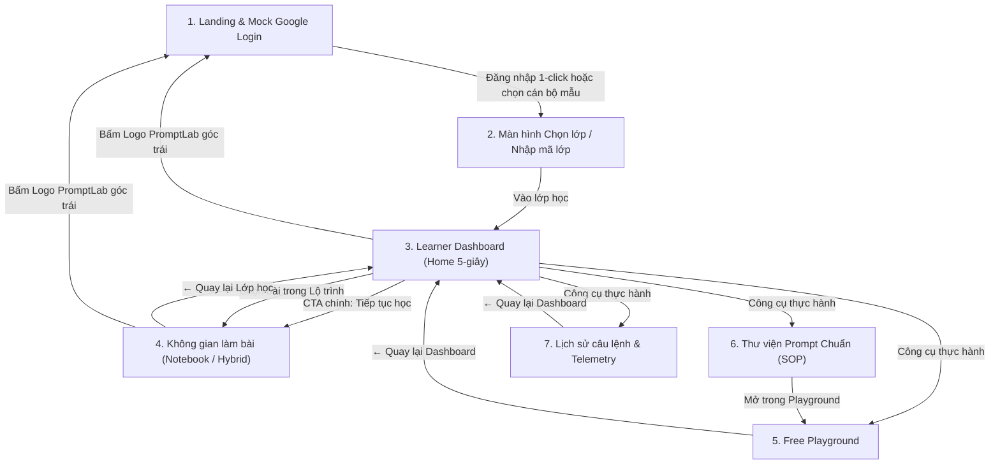

# TÀI LIỆU ĐẶC TẢ SẢN PHẨM & TỔNG KẾT MILESTONE MVP 1.0

> **Dự án:** Nghiên cứu & Xây dựng Nền tảng Đào tạo Kỹ thuật Prompt Engineering cho Cán bộ Nghiệp vụ (Business Users)  
> **Nhóm thực hiện:** Linh Phạm, Khang, Dương, Triết  
> **Đơn vị ứng dụng mục tiêu:** Agribank (Ban Truyền thông & Thương hiệu, Khối Quản lý Tín dụng) & Khối Doanh nghiệp  
> **Ngày chốt phiên bản MVP 1:** 21/09/2026  
> **Trạng thái:** ✅ Đã hoàn thiện & Triển khai thành công lên GitHub  

---

## 📌 1. Thông Tin Nhận Diện Dự Án (Project Identity)

| Thuộc tính | Chi tiết chốt |
| :--- | :--- |
| **Tên sản phẩm chính thức** | **Promptify** *(tên môi trường thực hành nội bộ: **PromptLab**)* |
| **Tagline định vị** | *"Học Prompt Engineering qua các tình huống công việc thực tế"* |
| **Phụ đề (English Subtitle)** | *Prompt Engineering for Non-techs & Business Users* |
| **Đối tượng người dùng (Persona)** | Cán bộ, chuyên viên nghiệp vụ văn phòng (Truyền thông, Tín dụng, Hành chính, Chăm sóc khách hàng) — **hoàn toàn không cần kiến thức lập trình**. |
| **GitHub Repository** | [https://github.com/ElysiaTheElysier/Promptify---Prompt_Engineering_For_Non-techs](https://github.com/ElysiaTheElysier/Promptify---Prompt_Engineering_For_Non-techs) |
| **Nhánh chính (Branch)** | `main` |
| **Công nghệ nền tảng** | React 18, TypeScript, Vite, Tailwind CSS, `@floating-ui/react`, Lucide Icons |

---

## 🎯 2. Tầm Nhìn & Mục Tiêu Cốt Lõi MVP 1 (Vision & Objectives)

Khác với các công cụ prompt engineering dành cho kỹ sư phần mềm (chú trọng token, latency, fine-tuning, Python code), **Promptify MVP 1** giải quyết bài toán của **người làm nghiệp vụ ngân hàng & doanh nghiệp**:
1. **Loại bỏ rào cản kỹ thuật:** Không hiển thị cấu hình phức tạp (API key, temperature, tham số token) ở giao diện chính; mọi khái niệm được chuyển ngữ sang bài toán văn phòng.
2. **Nguyên tắc "5 giây nắm bắt" tại Dashboard:** Khi học viên mở hệ thống, trong 5 giây phải trả lời được ngay:
   - *Tôi đang học lớp nào?* (Mã lớp, đơn vị, thời hạn sử dụng).
   - *Tôi đã học tới đâu?* (Thanh tiến độ, số bài đã làm).
   - *Tôi nên làm gì tiếp theo?* (Nút hành động chính to, rõ ràng: Tiếp tục bài đang học).
3. **Thực hành bám sát bài toán ngân hàng Agribank:**
   - Xử lý phản hồi tiêu cực của khách hàng trên App E-Mobile Banking.
   - Thẩm định hồ sơ vay vốn SME nông nghiệp sạch.
   - Định hình văn phong phát ngôn báo chí chuẩn mực (Brand Voice).
   - Buộc AI đối chiếu quy chế nội bộ, chống bịa đặt thông tin (Anti-Hallucination).

---

## 🔄 3. Toàn Bộ Luồng Trải Nghiệm Người Dùng (End-to-End User Flow)



---

## 💎 4. Chi Tiết Các Tính Năng Core Đã Chốt & Hoàn Thiện

### 4.1. Màn hình Landing & Đăng nhập Google (`LandingLoginScreen`)
- **Logo & Định vị thương hiệu:** Logo PromptLab hiện đại, badge *"Doanh nghiệp"*, cam kết an toàn dữ liệu nội bộ.
- **Giá trị cốt lõi:** Xuất bảng Markdown ngay để dán Excel, buộc AI đối chiếu tài liệu chống bịa đặt, chuẩn hóa văn phong ngân hàng.
- **Đăng nhập Google OAuth:** Nút chuẩn Google, kiến trúc component sẵn sàng nối OAuth 2.0.
- **Chọn nhanh tài khoản mẫu 1-click:**
  - *Linh Phạm* — Cán bộ Ban Truyền thông & Thương hiệu Agribank (`linh.pham@agribank.com.vn`).
  - *Minh Trần* — Cán bộ Khối Quản lý & Thẩm định Tín dụng Agribank (`minh.tran@agribank.com.vn`).

### 4.2. Quản Lý Lớp Học & Ghi Danh (`ClassSelectionScreen`)
- Thẻ lớp học (Class Cards) hiển thị đầy đủ ngữ cảnh doanh nghiệp:
  - Tên workshop: *Workshop: Prompt Engineering 2026*, *Chuyên đề AI Thẩm định Tín dụng*.
  - Khách hàng & Phòng ban: *Agribank Việt Nam · Ban Truyền thông*, *Khối Tín dụng*.
  - Ngành nghề: *Ngân hàng & Tài chính*, *Doanh nghiệp & Dịch vụ*.
  - Mã lớp (Class ID): `AGRI-COMM-2026-01`, `AGRI-CREDIT-2026-02`.
  - Thời hạn truy cập đếm ngược (Session Expiry): *"Còn 3 giờ 45 phút"*.
  - Thanh tiến trình học tập của học viên: `2 / 5 bài (40%)`.
- **Tham gia lớp học mới bằng mã:** Ô nhập mã lớp (ví dụ: `AGRI-CREDIT`) giúp ghi danh tự động.

### 4.3. Trung Tâm Học Tập 5-Giây (`LearnerDashboard`)
- **Khối chào mừng cá nhân hóa:** Tên học viên, phòng ban, lớp học, thời gian sử dụng còn lại.
- **Hộp tiến độ (Progress Widget):** Hiển thị số bài hoàn thành và tiến độ trực quan.
- **Nút CTA nổi bật nhất màn hình:** Nút lớn `▶ Tiếp tục bài đang học` (hoặc `Bắt đầu học ngay`) kèm huy hiệu nhấp nháy `✨ Kèm hướng dẫn lần đầu`.

### 4.4. Lộ Trình 5 Bước Tinh Thông Prompt (5-Stage Learning Path)
Mỗi bài có thẻ trạng thái trực quan (`✓ Đã hoàn thành`, `▶ Đang học`, `○ Chưa học`) và subtitle phi kỹ thuật:
1. **Bài 1: Zero-shot** — *Prompt cơ bản, chưa có ví dụ (Nhận diện nhược điểm câu lệnh sơ sài).*
2. **Bài 2: Structured Prompt** — *Thêm Role, Context, Constraint, Format (Chuẩn hóa công thức 5 thành tố).*
3. **Bài 3: One-shot** — *Học từ một ví dụ mẫu (Định hình văn phong chuẩn mực ngân hàng).*
4. **Bài 4: Few-shot & Grounding** — *Học từ nhiều ví dụ & Đối chiếu tài liệu (Nói có sách, mách có chứng).*
5. **Bài 5: Thực hành tự do** — *Áp dụng vào tình huống công việc thực tế của học viên.*

### 4.5. Không Gian Làm Bài Đa Giao Diện (Dual Workspace)
Người học có thể linh hoạt chuyển đổi giữa 2 chế độ:
- **Tích hợp song song (Hybrid Mode - Khuyên dùng):** Cột trái là đề bài, tình huống, dữ liệu kiểm soát; cột phải là ô soạn thảo prompt và kết quả sinh ra.
- **Sổ tay tuần tự (Notebook Mode):** Lấy cảm hứng từ Google Colab / Jupyter Notebook nhưng tối giản hóa triệt để (rộng 850px ở giữa, nhiều khoảng trắng, tuần tự: Đề bài → Viết Prompt → Chạy → Kết quả → Quan sát).
- **Thanh dẫn đường (Breadcrumb):** Nút `← Quay lại Lớp học` cùng breadcrumb phân cấp: `Lớp học > Lộ trình > Tên bài`.

### 4.6. Dữ Liệu Kiểm Soát & Quản Lý Phiên Bản Câu Lệnh (Versioning)
- **Control Data:** Cố định dữ liệu đầu vào (ví dụ: 5 phản hồi thô App Store hoặc hồ sơ tài chính 15 tỷ VND) để học viên nhận thức: *Cùng một dữ liệu, thay đổi câu lệnh sẽ thay đổi hoàn toàn chất lượng output*.
- **Prompt Versioning:** Tự động lưu từng lần thử: *Lần thử 1 | Lần thử 2 | Lần thử 3...* kèm thời điểm, kỹ thuật và thẻ phát hiện các thành phần vừa thêm (Role, Format, Constraint...).

### 4.7. Đối Chiếu Trước / Sau Phong Cách Google AI Studio (A/B Side-by-Side Compare)
- Chỉ hiển thị sau khi học viên đã chạy ít nhất 2 lần trong cùng một bài học.
- Bấm nút *"So sánh với lần trước"* sẽ mở Modal lớn 2 cột song song:
  - **Cột trái (Before):** Prompt cũ và Output cũ.
  - **Cột phải (After):** Prompt mới và Output mới.
- **Highlight thông minh:** Tô màu các thành phần mới thêm vào prompt (Role, Context, Constraint, Format, Example).
- **Giải thích sư phạm:** Nêu rõ lý do vì sao output mới vượt trội hơn (ví dụ: *Xuất bảng 5 cột có thể dán ngay vào Excel thay vì đoạn văn xuôi dài dòng*).

### 4.8. Bộ 5 Tiêu Chí Đánh Giá Nghiệp Vụ (Business Evaluation Rubric)
Được chấm tự động và cho phép người học tự kiểm tra (Self-check):
1. **Đúng định dạng (Format Adherence):** Xuất đúng bảng Markdown, gạch đầu dòng, danh sách.
2. **Độ đầy đủ (Completeness):** Bao quát đủ các khía cạnh bài toán yêu cầu.
3. **Tính hành động ngay (Actionability):** Giải pháp nghiệp vụ áp dụng được ngay, không lý thuyết suông.
4. **Tính bám sát dữ liệu (Groundedness):** Căn cứ 100% trên dữ liệu gốc, không tự chế thêm số liệu.
5. **Văn phong chuẩn mực (Tone Fit):** Khách quan, trang trọng, đúng mực văn phong Agribank.

### 4.9. Bé Trợ Lý AI Cute (AI Coach Mascot) & Onboarding Walkthrough
- **Bé Trợ lý AI dễ thương:** Xuất hiện ở góc phải dưới màn hình trong khu vực làm bài và Playground (ẩn ở màn login/chọn lớp). Chủ động gợi ý cách cải tiến prompt theo từng bài.
- **Guided Visual Walkthrough 8 bước:** Sử dụng thư viện `@floating-ui/react` thông minh (offset, flip, shift, autoUpdate):
  - Popover tuyệt đối không che khuất phần tử đang highlight.
  - Tự động chuyển hướng (trái, trên, dưới, phải) tối ưu góc nhìn.
  - **Tự động kích hoạt khi học viên vào làm bài lần đầu** (hoặc sau khi reset).

### 4.10. Thư Viện Prompt Chuẩn (SOP Library) & Lịch Sử (Prompt History)
- **Thư viện Prompt Toàn trang (`PromptLibraryView`):** Tìm kiếm tức thời, lọc theo kỹ thuật / Khuyên dùng (SOP), copy prompt 1-click và nút **"Mở trong Playground"** để thử ngay.
- **Lịch sử Telemetry Toàn trang (`PromptHistoryView`):** Lưu lại toàn bộ các lần chạy, xem chi tiết câu lệnh đã gửi đối chiếu với kết quả trả về, xuất báo cáo ra file Markdown.

### 4.11. Tính Năng Reset Về Landing Page Qua Logo
- Bấm vào **Logo PromptLab** ở góc trên bên trái bất kỳ lúc nào:
  - Reset sạch sẽ toàn bộ session, tiến độ tạm và **xóa cờ tutorial đã xem**.
  - Đưa người dùng về màn **Landing Page ban đầu**.
  - Lần đăng nhập tiếp theo khi vào bài, pop-up tutorial sẽ tự động hiển thị lại như người dùng mới hoàn toàn.

---

## 🏗️ 5. Cấu Trúc Mã Nguồn & Tổ Chức Thư Mục (Codebase Architecture)

```
c:\Ki_OJT\PromptforNontech\
├── .gitignore                     # Cấu hình bỏ qua node_modules, dist, logs
├── package.json                   # Dependencies: React 18, Vite, Tailwind, Floating UI, Lucide
├── tsconfig.json                  # Cấu hình TypeScript nghiêm ngặt
├── vite.config.ts                 # Cấu hình bundler Vite
├── tailwind.config.js             # Hệ thống màu sắc Agribank & Design tokens
├── README.md                      # Tài liệu tổng quan dự án trên GitHub
├── DOCUMENTATION_MVP1.md          # Tài liệu đặc tả sản phẩm & tổng kết này
│
└── src/
    ├── types/
    │   └── index.ts               # Data models: Learner, ClassCohort, Enrollment, LabStep, PromptVersion...
    │
    ├── data/
    │   ├── classesData.ts         # Dữ liệu mẫu lớp học, học viên demo, enrollment
    │   └── labsData.ts            # Dữ liệu chi tiết 5 bài lab nghiệp vụ Agribank
    │
    ├── services/
    │   ├── businessEvaluationService.ts # Đánh giá 5 tiêu chí nghiệp vụ, detect prompt tags, SOP library
    │   ├── llmService.ts          # Động cơ AI (Mô phỏng Stream & Gemini API thật)
    │   └── tutorialConfig.ts      # Cấu hình 8 bước Onboarding Walkthrough
    │
    └── components/
        ├── auth/
        │   └── LandingLoginScreen.tsx    # Màn hình Landing & Mock Google Login
        ├── classes/
        │   └── ClassSelectionScreen.tsx  # Màn hình chọn lớp & tham gia bằng mã
        ├── dashboard/
        │   └── LearnerDashboard.tsx      # Dashboard trung tâm 5-giây & lộ trình
        ├── navigation/
        │   └── ProductNavbar.tsx         # Thanh điều hướng toàn hệ thống & Logo Reset
        ├── lesson/
        │   └── LessonHeaderBar.tsx       # Breadcrumb & chuyển đổi giao diện trong bài học
        ├── hybrid/
        │   └── HybridView.tsx            # Giao diện Tích hợp song song (Đề trái - Làm phải)
        ├── notebook/
        │   ├── NotebookView.tsx          # Giao diện Sổ tay tuần tự kiểu Colab
        │   ├── NotebookCell.tsx          # Từng khối Cell bài tập
        │   └── NotebookCoach.tsx         # Coach đồng hành dạng inline
        ├── playground/
        │   └── PlaygroundView.tsx        # Phòng thực nghiệm tự do (Free Playground)
        ├── library/
        │   └── PromptLibraryView.tsx     # Thư viện Prompt chuẩn SOP toàn trang
        ├── history/
        │   └── PromptHistoryView.tsx     # Lịch sử câu lệnh & xuất báo cáo toàn trang
        └── common/
            ├── ABCompareModal.tsx        # Modal so sánh Trước/Sau kiểu Google AI Studio
            ├── AiCoach.tsx               # Bé Trợ lý AI Mascot dễ thương
            ├── GuidedWalkthrough.tsx     # Spotlight Tutorial 8 bước với Floating UI
            ├── PromptLibraryModal.tsx    # Modal tra cứu nhanh prompt mẫu
            ├── SavePromptModal.tsx       # Modal lưu prompt vào kho SOP
            ├── ExpirationBanner.tsx      # Banner đếm ngược thời gian phiên học
            ├── ApiKeyModal.tsx           # Modal cấu hình động cơ AI
            └── MarkdownView.tsx          # Renderer hiển thị bảng biểu & văn bản AI
```

---

## 📊 6. Mô Hình Dữ Liệu Sẵn Sàng Kết Nối Backend (Data Models)

Dù ở MVP 1 hệ thống đang chạy với local state & `localStorage`, toàn bộ TypeScript interfaces đã được chuẩn hóa theo kiến trúc RESTful / GraphQL tương lai:

```typescript
// 1. Thông tin Học viên
export interface Learner {
  id: string;
  name: string;
  email: string;
  role: 'STUDENT' | 'CLASS_MANAGER' | 'INSTRUCTOR';
  organization: string;
  department: string;
  avatarInitials?: string;
}

// 2. Lớp học & Khóa đào tạo
export interface ClassCohort {
  id: string;
  classCode: string;
  name: string;
  organization: string;
  industry: string;
  department: string;
  expiryDurationHours: number;
  expiryDateText?: string;
  description: string;
  iconName: string;
}

// 3. Tiến độ ghi danh của học viên
export interface Enrollment {
  learnerId: string;
  classId: string;
  completedLabIds: string[];
  currentLabId: string;
  enrolledAt: string;
  expiresAt: string;
}

// 4. Phiên bản câu lệnh qua từng lần thử
export interface PromptVersion {
  id: string;
  versionNumber: number;
  labId: string;
  promptText: string;
  output: string;
  techniqueUsed: string;
  detectedChanges: {
    hasRole: boolean;
    hasContext: boolean;
    hasConstraint: boolean;
    hasFormat: boolean;
    hasExample: boolean;
    hasGrounding: boolean;
  };
  timestamp: string;
  businessEvaluation: BusinessEvaluation;
}
```

---

## ✅ 7. Kết Quả Nghiệm Thu Kỹ Thuật (Verification & Quality Assurance)

1. **Kiểm thử biên dịch (Build Test):**
   - Lệnh: `npm run build`
   - Kết quả: **Thành công 100% trong 1.66s, 0 lỗi TypeScript, 0 cảnh báo cú pháp**.
2. **Kiểm thử đồng bộ Git (Version Control):**
   - Đã tạo repo, thiết lập nhánh `main`, commit sạch sẽ và push thành công lên:  
     `https://github.com/ElysiaTheElysier/Promptify---Prompt_Engineering_For_Non-techs.git`
3. **Kiểm thử tương tác người dùng (UI/UX Flows):**
   - [x] Vào URL gốc hiển thị màn hình Landing & Đăng nhập Google (không vào thẳng lab).
   - [x] Đăng nhập 1-click chuyển đến màn hình Chọn lớp với đầy đủ thông số phòng ban, ngành nghề, hạn dùng.
   - [x] Vào Dashboard trả lời trọn vẹn 3 câu hỏi trong 5 giây; nút CTA to rõ ràng.
   - [x] Bấm nút vào bài học lần đầu tiên: Pop-up Tutorial 8 bước tự động kích hoạt.
   - [x] Popover của Tutorial tự động căn vị trí thông minh, tuyệt đối không che khuất phần tử đang highlight.
   - [x] Sau 2 lần chạy câu lệnh, nút So sánh Trước/Sau mở Side-by-Side compare kiểu Google AI Studio.
   - [x] Bấm Logo PromptLab góc trên bên trái: Reset sạch sẽ toàn bộ trạng thái về Landing Page ban đầu.
   - [x] Thư viện Prompt hỗ trợ tìm kiếm, lọc danh mục và mở thẳng vào Playground.
   - [x] Lịch sử Telemetry lưu trữ các lần chạy và cho phép xuất file Markdown.

---

## 🚀 8. Định Hướng Phát Triển Tiếp Theo (Post-MVP Roadmap)

- [ ] **Giai đoạn 2 (Backend & Database):** Kết nối cơ sở dữ liệu PostgreSQL / Supabase để đồng bộ tiến độ học viên theo thời gian thực thay vì lưu trên trình duyệt.
- [ ] **Giai đoạn 3 (Enterprise SSO):** Tích hợp Google Workspace OAuth thật và Microsoft Azure AD SSO cho khối ngân hàng.
- [ ] **Giai đoạn 4 (Báo cáo Giảng viên / Dashboard Ban Tổ Chức):** Cung cấp giao diện quản trị cho Giảng viên theo dõi tỷ lệ hoàn thành bài tập, điểm số trung bình của từng chi nhánh/phòng ban Agribank.
- [ ] **Giai đoạn 5 (Fine-tuning Prompt Registry):** Cho phép các phòng ban tự xuất bản và phê duyệt (Approve) các Prompt SOP chuẩn mực vào kho tri thức chung của ngân hàng.

---

*Tài liệu được biên soạn và chuẩn hóa phục vụ báo cáo tiến độ dự án OJT & chuyển giao giải pháp.*
