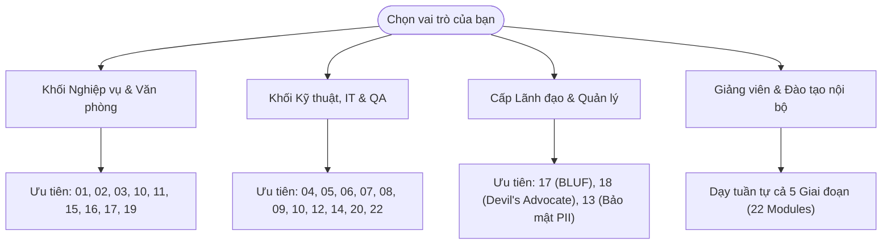

# 🤝 BIÊN BẢN BÀN GIAO TOÀN DIỆN DỰ ÁN PROMPTIFY
## (Comprehensive Project & Curriculum Hand-off Document)

> **Dành cho:** Đồng nghiệp tiếp nhận dự án, Giảng viên đào tạo nội bộ, Cán bộ Nghiệp vụ (Non-tech), Đội ngũ Kỹ thuật (Base Tech / IT), QA/QC và Quản lý dự án.  
> **Phiên bản:** v2.0 Enterprise Readiness  
> **Ngày bàn giao:** 25/09/2026  
> **Trạng thái:** ✅ Sẵn sàng 100% (Production & Training Ready)

---

## 🧭 1. TỔNG QUAN TÀI SẢN BÀN GIAO (DELIVERABLES OVERVIEW)

Dự án bàn giao bao gồm **3 khối tài sản hoàn chỉnh**:

```
┌──────────────────────────────────────────────────────────────────────────────────────────────────┐
│                                   TÀI SẢN DỰ ÁN PROMPTIFY                                        │
├────────────────────────────────┬────────────────────────────────┬────────────────────────────────┤
│ 1. KHO TRI THỨC 22 MODULES     │ 2. KẾ HOẠCH QA & TEST LOG      │ 3. ỨNG DỤNG WEB PROMPTIFY      │
│ Thư mục: curriculum-levels/    │ File: TEST_PLAN_AND_...        │ Thư mục: src/                  │
│ • 22 file Markdown chuyên sâu  │ • 8 module kiểm thử tự động    │ • Giao diện React + TypeScript │
│ • 4 tầng nhận thức / bài       │ • 24 test scripts kịch bản     │ • Dual Workspace (Hybrid/Note) │
│ • 100% bài tập có Prompt mẫu   │ • Báo cáo nghiệm thu & log lỗi │ • SOP Prompt Library có sẵn    │
└────────────────────────────────┴────────────────────────────────┴────────────────────────────────┘
```

1. **Kho Giáo trình Kỹ nghệ Prompt Đa Tầng (22 Modules):**
   - Nằm tại: [`curriculum-levels/`](file:///c:/Users/Admin/Documents/ThayDucStartup/Promptify---Prompt_Engineering_For_Non-techs/curriculum-levels)
   - Mỗi file là một tài liệu đào tạo độc lập, bao quát từ lý thuyết đến thực hành, thiết kế cho 4 đối tượng: Trẻ em 👶 ➔ Người cao tuổi 👵 ➔ Dân nghiệp vụ 💼 ➔ Dân kỹ thuật 💻.
2. **Kế hoạch Kiểm thử & Nhật ký QA:**
   - Nằm tại: [`TEST_PLAN_AND_EXECUTION_LOG.md`](file:///c:/Users/Admin/Documents/ThayDucStartup/Promptify---Prompt_Engineering_For_Non-techs/TEST_PLAN_AND_EXECUTION_LOG.md)
   - Bao gồm toàn bộ quy trình kiểm thử 8 module tính năng, 24 kịch bản tự động hóa, tiêu chuẩn nghiệm thu và log thực thi.
3. **Mã nguồn Nền tảng Web Promptify & Tài liệu Mentor:**
   - Xây dựng bằng React 18, TypeScript, Tailwind CSS, Vite.
   - Sẵn sàng khởi chạy tại máy trạm với lệnh `npm run dev`.
   - Xem thêm kiến trúc sư phạm v1 dành cho Mentor tại: [`PROMPTIFY_MENTOR_HANDOFF.md`](file:///c:/Users/Admin/Documents/ThayDucStartup/Promptify---Prompt_Engineering_For_Non-techs/PROMPTIFY_MENTOR_HANDOFF.md).

---

## 👥 2. KHUNG 4 TẦNG NHẬN THỨC (THE 4-LEVEL PERSONA FRAMEWORK)

Mọi tài liệu trong 22 bài học đều tuân thủ nghiêm ngặt khung sư phạm đa tầng:

| Cấp độ | Đối tượng | Đặc trưng sư phạm & Phong cách truyền tải |
| :---: | :--- | :--- |
| **Level 1** | 👶 **Trẻ em (ELIF5)** | Ẩn dụ qua đồ chơi LEGO, phim Doraemon, que tính, truyện cổ tích. Giúp người đọc hiểu ngay bản chất nguyên lý cốt lõi trong **30 giây** mà không gặp bất kỳ thuật ngữ khó hiểu nào. |
| **Level 2** | 👵 **Người cao tuổi (Seniors / Elders)** | Lời văn ân cần, gần gũi với đời sống: đi chợ quê, uống trà, sổ tay ghi số điện thoại cạnh tủ lạnh, đo huyết áp, bài thuốc dân gian. Rèn luyện tư duy an toàn và tránh bẫy lừa đảo qua mạng. |
| **Level 3** | 💼 **Dân Nghiệp vụ / Văn phòng (Business Non-Tech)** | Trực diện vào các bài toán ngân hàng Agribank, tài chính, tín dụng, kế toán, văn thư, xử lý công nợ, quan hệ khách hàng. Tập trung vào việc **tiết kiệm 80% thời gian thủ công** và **chống sai lệch dữ liệu**. |
| **Level 4** | 💻 **Dân Kỹ thuật / IT (Base Tech - Không nặng code)** | **LƯU Ý ĐẶC BIỆT:** Không yêu cầu viết script code phức tạp (Python, Node.js)! Tập trung 100% vào **Kỹ nghệ Prompt hệ thống**: Cấu trúc System Prompt, thẻ XML phân vùng dữ liệu, thiết kế JSON Schema / Interface, tham số Playground ($T$, Top-P, Seed), Meta-Prompting và tối ưu hóa Prefix Caching. |

---

## 🚀 3. HƯỚNG DẪN ĐỒNG NGHIỆP CÁCH ĐỌC & LÀM BÀI TẬP

Tài liệu được thiết kế theo cơ chế **"Cầm tay chỉ việc — Tự học không cần trợ giảng"**. Đồng nghiệp tiếp nhận có thể bắt đầu ngay theo các bước sau:

### Bước 1: Chuẩn bị công cụ (Hoàn toàn miễn phí, không cần cài đặt môi trường code)
Đồng nghiệp chỉ cần mở một trong các công cụ trò chuyện AI sẵn có:
- **Dành cho Non-tech & Nghiệp vụ:** ChatGPT (bản miễn phí hoặc Plus), Claude.ai, Google Gemini, hoặc Microsoft Copilot.
- **Dành cho Kỹ thuật / IT:** [Google AI Studio](https://aistudio.google.com/) hoặc [OpenAI Playground](https://platform.openai.com/playground) (để điều chỉnh núm vặn `Temperature`, `Top-P`, và nhập `System Instructions`).

### Bước 2: Chọn bài học trong danh mục
Mở file bài học tương ứng trong thư mục [`curriculum-levels/`](file:///c:/Users/Admin/Documents/ThayDucStartup/Promptify---Prompt_Engineering_For_Non-techs/curriculum-levels).
- Đọc lướt phần **Khái Niệm Tổng Quan** và **4 Tầng Nhận Thức** để hiểu bản chất kỹ thuật.

### Bước 3: Thực hành bài tập tại mục "## 📝 Bộ Bài Tập Thực Hành Đa Tầng"
Mỗi bài tập đã được trang bị sẵn 3 phần:
1. **Tình huống (Scenario):** Đọc để hiểu bối cảnh nghiệp vụ cần giải quyết.
2. **Prompt mẫu để thử (Copy & Paste Ready):**
   - Bấm chuột copy toàn bộ nội dung trong ô ` ```text `
   - Dán thẳng vào ô chat của AI (hoặc Playground).
   - Nhấn **Gửi (Enter)**.
3. **Đối chiếu Tiêu chuẩn nghiệm thu (Acceptance Criteria):**
   - Đọc kết quả AI sinh ra.
   - So sánh với mục **Kết quả mong đợi & Tiêu chuẩn nghiệm thu** trong bài học xem AI có trả lời đúng trọng tâm, chuẩn định dạng và không bị ảo giác hay không.

### Bước 4: Ứng dụng vào công việc hàng ngày
Thay thế các chi tiết trong prompt mẫu bằng số liệu, tên khách hàng hoặc nghiệp vụ thực tế của phòng ban mình để xử lý công việc ngay.

---

## 🗺️ 4. BẢNG TRA CỨU 22 MODULES & LỘ TRÌNH THEO VAI TRÒ

### 4.1. Lộ trình gợi ý theo vai trò (Role-Based Pathways)



- **💼 Dành cho Cán bộ Nghiệp vụ / Kinh doanh / Tín dụng / Marketing:**
  - *Module cần học trước:* `01` (Zero-shot) ➔ `02` (5 Thành tố) ➔ `03` (Few-shot) ➔ `10` (Bảng biểu/JSON) ➔ `11` (Bám sát quy chế) ➔ `16` (Ngoại giao công sở) ➔ `17` (Báo cáo ngắn BLUF).
- **💻 Dành cho Kỹ sư IT / Tester / Data / System Admin:**
  - *Module cần học trước:* `07` (ReAct) ➔ `08` (Function Calling) ➔ `09` (Tham số T & P) ➔ `10` (JSON Schema) ➔ `12` (Meta-Prompting) ➔ `14` (Sandwich Defense) ➔ `20` (Self-Refine) ➔ `22` (Prompt Caching).
- **👔 Dành cho Quản lý / Ban Giám đốc:**
  - *Module cần học trước:* `17` (Cấu trúc BLUF 30 giây) ➔ `18` (Phản biện rủi ro dự án) ➔ `13` (Tuân thủ bảo vệ dữ liệu PII Nghị định 13).

---

### 4.2. Danh mục chi tiết 22 Modules bài giảng

| STT | File Module | Tên Kỹ Thuật | Trọng Tâm Đầu Ra Nghiệp Vụ |
| :---: | :--- | :--- | :--- |
| **01** | [`01_ZERO_SHOT_PROMPTING.md`](file:///c:/Users/Admin/Documents/ThayDucStartup/Promptify---Prompt_Engineering_For_Non-techs/curriculum-levels/01_ZERO_SHOT_PROMPTING.md) | Ra lệnh trực tiếp (Zero-Shot) | Hiểu giới hạn của câu lệnh sơ sài; cách giao việc rõ ràng ngay từ lệnh đầu. |
| **02** | [`02_STRUCTURED_5_ELEMENTS.md`](file:///c:/Users/Admin/Documents/ThayDucStartup/Promptify---Prompt_Engineering_For_Non-techs/curriculum-levels/02_STRUCTURED_5_ELEMENTS.md) | Khung 5 thành tố (RCTCF) | Bộ khung chuẩn: Vai trò - Bối cảnh - Nhiệm vụ - Ràng buộc - Định dạng. |
| **03** | [`03_FEW_SHOT_AND_IN_CONTEXT_LEARNING.md`](file:///c:/Users/Admin/Documents/ThayDucStartup/Promptify---Prompt_Engineering_For_Non-techs/curriculum-levels/03_FEW_SHOT_AND_IN_CONTEXT_LEARNING.md) | Dạy qua ví dụ mẫu (Few-Shot) | Định hình văn phong thương hiệu và chuẩn hóa mẫu báo cáo bằng 2-3 ví dụ. |
| **04** | [`04_CHAIN_OF_THOUGHT_COT.md`](file:///c:/Users/Admin/Documents/ThayDucStartup/Promptify---Prompt_Engineering_For_Non-techs/curriculum-levels/04_CHAIN_OF_THOUGHT_COT.md) | Chuỗi suy nghĩ (CoT) | Buộc AI tư duy từng bước công khai; triệt tiêu lỗi tính toán tài chính. |
| **05** | [`05_TREE_OF_THOUGHTS_TOT.md`](file:///c:/Users/Admin/Documents/ThayDucStartup/Promptify---Prompt_Engineering_For_Non-techs/curriculum-levels/05_TREE_OF_THOUGHTS_TOT.md) | Cây tư duy rẽ nhánh (ToT) | Khám phá nhiều phương án xử lý nợ / kiến trúc, chấm điểm và tỉa cành. |
| **06** | [`06_SELF_CONSISTENCY_AND_ENSEMBLING.md`](file:///c:/Users/Admin/Documents/ThayDucStartup/Promptify---Prompt_Engineering_For_Non-techs/curriculum-levels/06_SELF_CONSISTENCY_AND_ENSEMBLING.md) | Bỏ phiếu đa số (Ensembling) | Chạy đa luồng độc lập, gom kết quả và chọn phương án chiếm đa số. |
| **07** | [`07_REACT_AND_AGENTIC_LOOPS.md`](file:///c:/Users/Admin/Documents/ThayDucStartup/Promptify---Prompt_Engineering_For_Non-techs/curriculum-levels/07_REACT_AND_AGENTIC_LOOPS.md) | Vòng lặp Agentic (ReAct) | Cơ chế Suy nghĩ ➔ Hành động ➔ Quan sát để tự động giải quyết tác vụ. |
| **08** | [`08_TOOL_AND_FUNCTION_CALLING.md`](file:///c:/Users/Admin/Documents/ThayDucStartup/Promptify---Prompt_Engineering_For_Non-techs/curriculum-levels/08_TOOL_AND_FUNCTION_CALLING.md) | Gọi công cụ ngoài (Function Call) | Định nghĩa Schema công cụ để AI kết nối API tính lãi suất, kiểm tra đơn hàng. |
| **09** | [`09_SAMPLING_PARAMETERS_T_AND_P.md`](file:///c:/Users/Admin/Documents/ThayDucStartup/Promptify---Prompt_Engineering_For_Non-techs/curriculum-levels/09_SAMPLING_PARAMETERS_T_AND_P.md) | Núm vặn tham số ($T$, Top-P) | Điều khiển tính sáng tạo vs tính chính xác tuyệt đối trên Playground. |
| **10** | [`10_STRUCTURED_OUTPUTS_AND_JSON.md`](file:///c:/Users/Admin/Documents/ThayDucStartup/Promptify---Prompt_Engineering_For_Non-techs/curriculum-levels/10_STRUCTURED_OUTPUTS_AND_JSON.md) | Định dạng có cấu trúc & JSON | Ép kết quả thành bảng Excel Markdown hoặc JSON Schema chuẩn không rác. |
| **11** | [`11_GROUNDING_RAG_CONTEXT_ENGINEERING.md`](file:///c:/Users/Admin/Documents/ThayDucStartup/Promptify---Prompt_Engineering_For_Non-techs/curriculum-levels/11_GROUNDING_RAG_CONTEXT_ENGINEERING.md) | Neo dữ liệu & Chống ảo giác (RAG) | Ràng buộc AI chỉ trả lời dựa vào văn bản quy chế kèm trích dẫn điều khoản. |
| **12** | [`12_STEP_BACK_AND_META_PROMPTING.md`](file:///c:/Users/Admin/Documents/ThayDucStartup/Promptify---Prompt_Engineering_For_Non-techs/curriculum-levels/12_STEP_BACK_AND_META_PROMPTING.md) | Lùi một bước & Meta-Prompt | Tìm nguyên lý cốt lõi; dùng AI làm chuyên gia tối ưu hóa chính câu lệnh của mình. |
| **13** | [`13_PII_SCRUBBING_AND_DATA_PRIVACY.md`](file:///c:/Users/Admin/Documents/ThayDucStartup/Promptify---Prompt_Engineering_For_Non-techs/curriculum-levels/13_PII_SCRUBBING_AND_DATA_PRIVACY.md) | Khử định danh dữ liệu nhạy cảm | Che giấu CCCD, Số tài khoản, Khách hàng VIP theo Nghị định 13/2023. |
| **14** | [`14_PROMPT_INJECTION_AND_DEFENSE.md`](file:///c:/Users/Admin/Documents/ThayDucStartup/Promptify---Prompt_Engineering_For_Non-techs/curriculum-levels/14_PROMPT_INJECTION_AND_DEFENSE.md) | Phòng thủ bẻ khóa (Sandwich Defense) | Ngăn chặn người dùng ác ý ép AI phá quy chế bảo mật hoặc tiết lộ Prompt bí mật. |
| **15** | [`15_FLIPPED_INTERACTION_AND_SOCRATIC.md`](file:///c:/Users/Admin/Documents/ThayDucStartup/Promptify---Prompt_Engineering_For_Non-techs/curriculum-levels/15_FLIPPED_INTERACTION_AND_SOCRATIC.md) | Đảo ngược tương tác (Socratic) | Khi bí ý tưởng, yêu cầu AI phỏng vấn mình từng câu một để làm rõ yêu cầu. |
| **16** | [`16_DIPLOMATIC_AND_TONE_SHIFTING.md`](file:///c:/Users/Admin/Documents/ThayDucStartup/Promptify---Prompt_Engineering_For_Non-techs/curriculum-levels/16_DIPLOMATIC_AND_TONE_SHIFTING.md) | Nghệ thuật chuyển dịch tông giọng | Soạn thư đòi nợ lịch sự, viết báo cáo sự cố không đổ lỗi (Blameless Post-Mortem). |
| **17** | [`17_BLUF_AND_EXECUTIVE_BRIEFING.md`](file:///c:/Users/Admin/Documents/ThayDucStartup/Promptify---Prompt_Engineering_For_Non-techs/curriculum-levels/17_BLUF_AND_EXECUTIVE_BRIEFING.md) | Đưa kết luận lên đầu (BLUF) | Báo cáo tờ trình 50 tỷ cho Ban Giám đốc duyệt trong 30 giây; cảnh báo sự cố P0. |
| **18** | [`18_DEVIL_ADVOCATE_AND_RISK_AUDIT.md`](file:///c:/Users/Admin/Documents/ThayDucStartup/Promptify---Prompt_Engineering_For_Non-techs/curriculum-levels/18_DEVIL_ADVOCATE_AND_RISK_AUDIT.md) | Kẻ phản biện rủi ro (Devil's Advocate)| Tước bỏ tính nịnh hót; chỉ ra điểm nghẽn, bẫy hợp đồng và lỗ hổng kiến trúc. |
| **19** | [`19_ACTION_BREAKDOWN_AND_SYNTHESIS.md`](file:///c:/Users/Admin/Documents/ThayDucStartup/Promptify---Prompt_Engineering_For_Non-techs/curriculum-levels/19_ACTION_BREAKDOWN_AND_SYNTHESIS.md) | Phân rã hành động & Tổng hợp | Biến cuộc họp hỗn loạn thành Action Matrix 5 cột; bẻ nhỏ Epic thành Jira Tasks. |
| **20** | [`20_SELF_REFINE_AND_REFLEXION.md`](file:///c:/Users/Admin/Documents/ThayDucStartup/Promptify---Prompt_Engineering_For_Non-techs/curriculum-levels/20_SELF_REFINE_AND_REFLEXION.md) | Tự phản tư & Tự hoàn thiện | Quy trình 3 bước: Soạn thô ➔ Tự soi lỗi phản tư ➔ Xuất bản bản v2 hoàn hảo. |
| **21** | [`21_MULTIMODAL_VISION_PROMPTING.md`](file:///c:/Users/Admin/Documents/ThayDucStartup/Promptify---Prompt_Engineering_For_Non-techs/curriculum-levels/21_MULTIMODAL_VISION_PROMPTING.md) | Prompting Thị giác & Hình ảnh | Đọc bảng cân đối kế toán scan, nhận diện đơn thuốc, chuyển ảnh sơ đồ thành Mermaid. |
| **22** | [`22_PROMPT_CACHING_AND_EFFICIENCY.md`](file:///c:/Users/Admin/Documents/ThayDucStartup/Promptify---Prompt_Engineering_For_Non-techs/curriculum-levels/22_PROMPT_CACHING_AND_EFFICIENCY.md) | Tối ưu bộ nhớ đệm (Prompt Caching) | Sắp xếp Prefix tĩnh lên đầu; tiết kiệm 90% chi phí token và giảm 70% độ trễ API. |

---

## 💻 5. BÀN GIAO KỸ THUẬT ỨNG DỤNG WEB PROMPTIFY

Nếu đồng nghiệp muốn khởi chạy hoặc phát triển tiếp giao diện web ứng dụng:

### 5.1. Khởi chạy môi trường phát triển (Local Development)
```bash
# Cài đặt thư viện phụ thuộc
npm install

# Khởi chạy máy chủ phát triển
npm run dev
```
- Ứng dụng chạy tại: `http://localhost:5173/` (hoặc cổng hiển thị trên terminal).

### 5.2. Kiểm tra chất lượng mã nguồn (Healthcheck)
```bash
# Kiểm tra TypeScript type safety (bảo đảm 0 lỗi)
npx tsc --noEmit

# Đóng gói sản phẩm production
npm run build
```

### 5.3. Cấu trúc thư mục mã nguồn chính:
- `src/components/`: Chứa các thành phần giao diện (Dual Workspace, Breadcrumb, Side-by-Side Comparison, SOP Library Modal).
- `src/data/`: Chứa dữ liệu bài học mẫu, thư viện prompt chuẩn của ngân hàng Agribank.
- `src/types/`: Khai báo kiểu dữ liệu TypeScript nghiêm ngặt.

---

## ✅ 6. CHECKLIST NGHIỆM THU KHI NHẬN BÀN GIAO

Đồng nghiệp nhận bàn giao vui lòng tích chọn các mục sau để xác nhận hoàn tất:

- [ ] **Tài liệu Giáo trình:** Đã truy cập được thư mục [`curriculum-levels/`](file:///c:/Users/Admin/Documents/ThayDucStartup/Promptify---Prompt_Engineering_For_Non-techs/curriculum-levels) và đọc thử tối thiểu 1 bài học bất kỳ.
- [ ] **Thực hành mẫu:** Đã copy thử 1 prompt mẫu trong bài và dán vào ChatGPT / Claude / Playground, nhận được kết quả tương ứng.
- [ ] **Lưu ý Level 4:** Đã nắm rõ nguyên tắc Level 4 không yêu cầu code mà tập trung vào kiến trúc prompt, system prompt và schema.
- [ ] **Kế hoạch kiểm thử:** Đã kiểm tra file [`TEST_PLAN_AND_EXECUTION_LOG.md`](file:///c:/Users/Admin/Documents/ThayDucStartup/Promptify---Prompt_Engineering_For_Non-techs/TEST_PLAN_AND_EXECUTION_LOG.md).
- [ ] **Mã nguồn:** Đã chạy thử lệnh `npx tsc --noEmit` và xác nhận hệ thống đạt **0 lỗi type error**.

---
*Tài liệu bàn giao được lập bởi AI Coding Assistant — Promptify Team (2026).*
