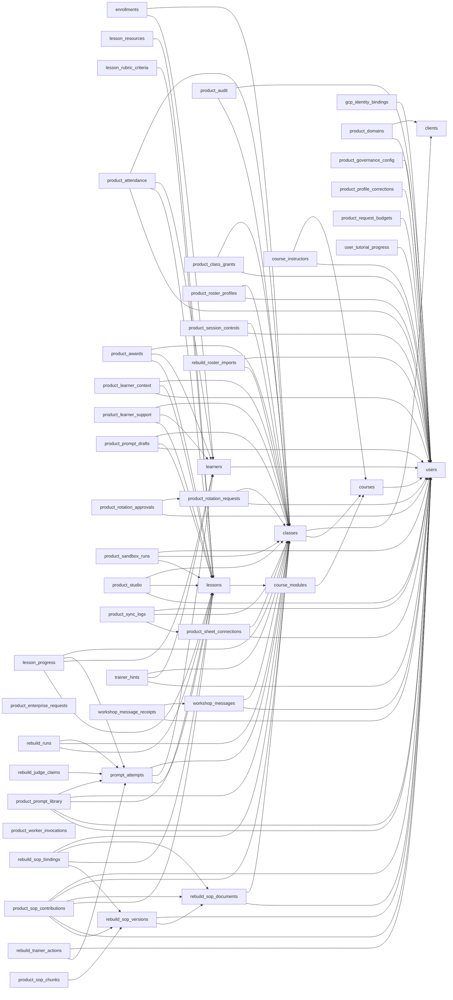

# Quan hệ dữ liệu Intrepid

Quan hệ lấy từ foreign keys đã dựng. GCP identity bindings là bảng mới đề xuất. Không biểu diễn ngược cardinality nếu schema không xác nhận.

```mermaid
flowchart LR
  classes["classes"]
  clients["clients"]
  course_instructors["course_instructors"]
  course_modules["course_modules"]
  courses["courses"]
  enrollments["enrollments"]
  gcp_identity_bindings["gcp_identity_bindings"]
  learners["learners"]
  lesson_progress["lesson_progress"]
  lesson_resources["lesson_resources"]
  lesson_rubric_criteria["lesson_rubric_criteria"]
  lessons["lessons"]
  product_attendance["product_attendance"]
  product_audit["product_audit"]
  product_awards["product_awards"]
  product_class_grants["product_class_grants"]
  product_domains["product_domains"]
  product_enterprise_requests["product_enterprise_requests"]
  product_governance_config["product_governance_config"]
  product_learner_context["product_learner_context"]
  product_learner_support["product_learner_support"]
  product_profile_corrections["product_profile_corrections"]
  product_prompt_drafts["product_prompt_drafts"]
  product_prompt_library["product_prompt_library"]
  product_request_budgets["product_request_budgets"]
  product_roster_profiles["product_roster_profiles"]
  product_rotation_approvals["product_rotation_approvals"]
  product_rotation_requests["product_rotation_requests"]
  product_sandbox_runs["product_sandbox_runs"]
  product_session_controls["product_session_controls"]
  product_sheet_connections["product_sheet_connections"]
  product_sop_chunks["product_sop_chunks"]
  product_sop_contributions["product_sop_contributions"]
  product_studio["product_studio"]
  product_sync_logs["product_sync_logs"]
  product_worker_invocations["product_worker_invocations"]
  prompt_attempts["prompt_attempts"]
  rebuild_judge_claims["rebuild_judge_claims"]
  rebuild_roster_imports["rebuild_roster_imports"]
  rebuild_runs["rebuild_runs"]
  rebuild_sop_bindings["rebuild_sop_bindings"]
  rebuild_sop_documents["rebuild_sop_documents"]
  rebuild_sop_versions["rebuild_sop_versions"]
  rebuild_trainer_actions["rebuild_trainer_actions"]
  trainer_hints["trainer_hints"]
  user_tutorial_progress["user_tutorial_progress"]
  users["users"]
  workshop_message_receipts["workshop_message_receipts"]
  workshop_messages["workshop_messages"]
  classes --> clients
  classes --> courses
  course_instructors --> courses
  course_instructors --> users
  course_modules --> courses
  courses --> users
  enrollments --> classes
  enrollments --> learners
  gcp_identity_bindings --> users
  learners --> users
  lesson_progress --> classes
  lesson_progress --> prompt_attempts
  lesson_progress --> learners
  lesson_progress --> lessons
  lesson_resources --> lessons
  lesson_rubric_criteria --> lessons
  lessons --> course_modules
  product_attendance --> classes
  product_attendance --> learners
  product_attendance --> lessons
  product_attendance --> users
  product_audit --> users
  product_audit --> classes
  product_awards --> classes
  product_awards --> learners
  product_awards --> lessons
  product_class_grants --> classes
  product_class_grants --> users
  product_domains --> clients
  product_domains --> users
  product_governance_config --> users
  product_learner_context --> classes
  product_learner_context --> lessons
  product_learner_context --> users
  product_learner_support --> classes
  product_learner_support --> learners
  product_learner_support --> lessons
  product_profile_corrections --> users
  product_prompt_drafts --> classes
  product_prompt_drafts --> lessons
  product_prompt_drafts --> users
  product_prompt_library --> prompt_attempts
  product_prompt_library --> classes
  product_prompt_library --> lessons
  product_prompt_library --> users
  product_prompt_library --> users
  product_request_budgets --> users
  product_roster_profiles --> classes
  product_roster_profiles --> users
  product_rotation_approvals --> product_rotation_requests
  product_rotation_approvals --> users
  product_rotation_requests --> classes
  product_rotation_requests --> users
  product_sandbox_runs --> users
  product_sandbox_runs --> classes
  product_sandbox_runs --> lessons
  product_session_controls --> classes
  product_session_controls --> users
  product_sheet_connections --> classes
  product_sheet_connections --> users
  product_sop_chunks --> rebuild_sop_versions
  product_sop_contributions --> users
  product_sop_contributions --> classes
  product_sop_contributions --> rebuild_sop_documents
  product_sop_contributions --> lessons
  product_sop_contributions --> users
  product_sop_contributions --> rebuild_sop_versions
  product_studio --> classes
  product_studio --> lessons
  product_studio --> users
  product_sync_logs --> users
  product_sync_logs --> classes
  product_sync_logs --> product_sheet_connections
  prompt_attempts --> classes
  prompt_attempts --> learners
  prompt_attempts --> lessons
  rebuild_judge_claims --> prompt_attempts
  rebuild_roster_imports --> users
  rebuild_roster_imports --> classes
  rebuild_runs --> prompt_attempts
  rebuild_runs --> classes
  rebuild_runs --> lessons
  rebuild_sop_bindings --> classes
  rebuild_sop_bindings --> rebuild_sop_documents
  rebuild_sop_bindings --> lessons
  rebuild_sop_bindings --> rebuild_sop_versions
  rebuild_sop_documents --> classes
  rebuild_sop_documents --> users
  rebuild_sop_versions --> users
  rebuild_sop_versions --> rebuild_sop_documents
  rebuild_trainer_actions --> users
  rebuild_trainer_actions --> prompt_attempts
  trainer_hints --> classes
  trainer_hints --> learners
  trainer_hints --> users
  user_tutorial_progress --> users
  workshop_message_receipts --> workshop_messages
  workshop_message_receipts --> users
  workshop_messages --> classes
  workshop_messages --> users
```
